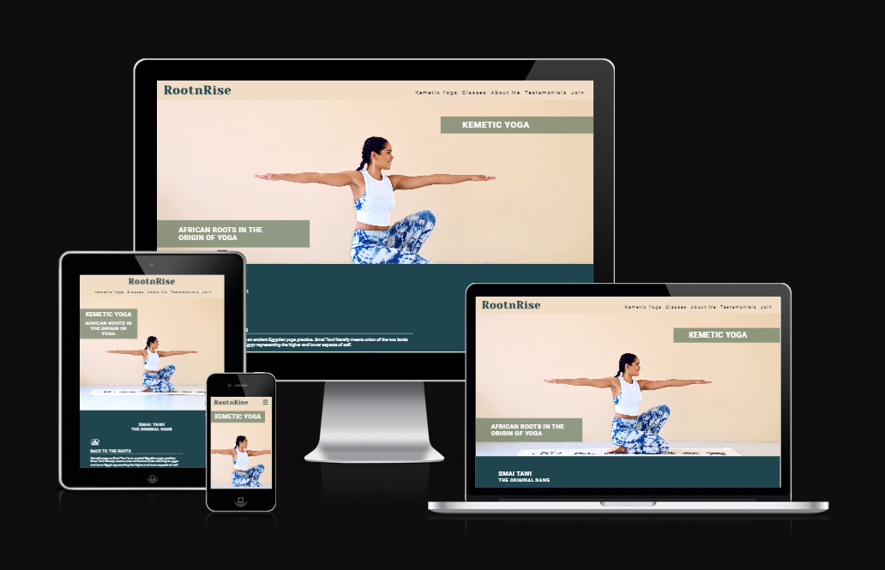

# RootnRise
## Code Institute - First Milestone Project: User Centric Frontend Development.

Welcome,

RootnRise strives to inform people of color about an ancient egyptian yoga system called Kemetic Yoga. The website is intended to create an online presence for my wife Tasha Quaynor, a certified "Basu" - a teacher of this practice, helping her offer Yoga classes, expand her member base and build a community.
For the bipoc community it offers the chance to touch upon to their ancestral wisdom, connecting to their african roots, joining their tribe while boosting their health and wellbeing.

# Table of Contents
- [RootnRise](#rootnrise)
  - [Code Institute - First Milestone Project: User Centric Frontend Development.](#code-institute---first-milestone-project-user-centric-frontend-development)
- [Table of Contents](#table-of-contents)
  - [Demo](#demo)
    - [A live demo to the website can be found here](#a-live-demo-to-the-website-can-be-found-here)
  - [UX](#ux)
  - [User stories](#user-stories)
    - [Strategy](#strategy)
    - [Scope](#scope)
    - [Skeleton](#skeleton)
    - [Surface](#surface)
  - [Technologies](#technologies)
  - [Features](#features)
    - [Existing Features](#existing-features)
    - [Features Left to Implement](#features-left-to-implement)
  - [Testing](#testing)
    - [Validator Testing](#validator-testing)
    - [Bugs](#bugs)
  - [Deployment](#deployment)
  - [Credits](#credits)
    - [Content](#content)
    - [Media](#media)
    - [Acknowledgements](#acknowledgements)

## Demo

### A live demo to the website can be found [here](https://equaynor.github.io/root-rise/)

## UX
Ther user group targeted by this website are people of color with an interest in yoga.
The site is focused on simplicity and ease of navigation for the user's main focus areas on the topic at hand.

## User stories
As this website is meant for my wife, the purpose is to create an online presence and enable her to showcase expertise and services offered.
The following points are applicable to the users:

- As a user, I want to understand the purpose of this website quickly and easily.
- As a user, I want to easily navigate this website (by using a mouse, a keyboard, or a touch screen).
- As a user, I want to find general information on the topic.
- As a user, I want to know what differenciates this yoga practise from others.
- As a user, I want to get to know the yoga teacher.
- As a user, I want to see when classes are available.
- As a user, I want a way to contact this yoga teacher.

### Strategy
The goal is to make a well-functioning professional Kemetic Yoga website. The focus was on making the design both user-friendly, inviting and creative.

### Scope
For the users, I wanted a simple first version of the website allowing them to get familiar with the yoga practice and the teacher.

### Skeleton
The website is designed to be clear and simple. And the site has a simple tree structure with hierarchical flows from top to bottom.

**Website Sections:**

1. **_Home / Landing page:_** A first peak at the topic.
2. **_Kemetic Yoga:_** General information on Kemetic Yoga.
3. **_Classes:_** Weekly dates for the online classes.
4. **_About Me:_** Information on the yoga teacher.
5. **_Testamonials:_** Testamonials of people who joined a class.
6. **_Footer:_** Social media links and copywriting information.

**Wireframe**
The wireframe is designed using Balsamiq software. Initially the website was supposed to be more complex, i.e. including a feature section right below the hero image that turns into a navigation bar once the user scrolls past it. The wireframe was also designed to focus on each and every section as a single page and connect them using the navigation. Some other minor details like the position of the logo on the nav bar diverge from the final website simple due to my inexperience with Balsamiq.
Under the guidance of my mentor, we decided to leave out more complex elements, comprise the content and use a single-page layout given the limited time left and the approaching deadline.

My wireframe design in the [(pdf format)](./assets/readme-assets/wireframe.pdf)

### Surface
I have selected to go with a modern african inspired color scheme.

[Color Scheme](./assets/readme-assets/color-scheme.png)

## Technologies
1. HTML - To create a basic site
2. CSS - To create a nice, standout front-end and to give a great user experience
3. Balsamiq - To create a wireframe

## Features
### Existing Features

* **Navigation Bar**
  * The navigation bar is at the top of the page, and it is fixed to the top. The logo is in the left-hand corner of the navigation, and it links to the index.html page. 
  * The other navigation links on the website are to the right. Kemetic Yoga, Classes, About Me, Testamonials, and Join connect to different sections of the same page.
  * The font color is in contrast with the navigation background color. The hover effect is used for navigation, so the user can know which page they are on. 
  * The navigation bar turns into a burger menu on mobile devices for a better user experience.

* **Hero Image**
  * The landing includes a photograph with text overlay to allow the user to see exactly what the website is about.
  * This section introduces the user to RootnRise with an eye catching animation to grab their attention.

* **Kemetic Yoga**
  * This section features four key information points highlighting the benefits of Kemetic Yoga and why the user should engage.
  * Each point is highlighted by an resonating icon.
  * Following is a video to give more background information.

  * **Classes**
  * Shows a table of weekdays and times.

 * **About Me**
 * Provides an image of the Yoga Teacher Tasha Quaynor.
 * Image is intentionally moves slightly our of frame on desktop devices to create an even more engaging design.
 * Gives a brief introduction as to who she is to build trust.

* **Testamonials**
* Shows 3 different images of happy customers/members and what they had so say about their experience.
* Uses the concept of social proof the build more trust.

* **Join**
* This allows the user to get in touch and also choose a preferred class.

* **Footer**
* Includes the (dummy) social media links of RootnRise so users can engage on different channels.

### Features Left to Implement
In the future,
* I would like to stick the navbar beneath the hero image. 
* I would like to add a vegan nutrition page, since my wife is also a certified vegan nutrition consultant.
* I would like to add a blog.
* I would change the layout from single-page to multi-page.
* I would like to expand the contact form and make it functional.
* I would like to build in a booking system.
* I would like to improve the performance of the website.

## Testing
* I tested the site, and it works in different web browsers: Chrome, Firefox, and Microsoft Edge.
* I confirmed that the site is responsive and functions on different screen sizes using the devtools device toolbar.
* I confirmed that everything is readable and easy to understand.
* I confirmed that the form works: it requires entries in every field, only accepts an email in the email field, and the submit button work.

### Validator Testing
* **HTML**
  No errors were returned when passing through the official [W3C validator](./assets/readme-assets/html-validator-result.png)

* **CSS**
  No errors were found when passing through the official [(Jigsaw) validator](./assets/readme-assets/css-validator-result.png)
  
* **Accessibility**
  I confirmed that the colors and fonts chosen are easy to read and accessible by running it through [Lighthouse DevTools](./assets/readme-assets/site-accessibility.png)

### Bugs
* **Solved bugs**
- The navigation bar wasn't centered for tablet devices. Fixed by using flexbox properties in header.
- The About Me section image was overflowing and enabled horizontal scrolling. Fixed by correctly applying overflow properties.
- The testamonial picture no.3 wasn't scaling correctly on desktop. Fixed by applying width in px instead of %.
  
  
* **Unfixed Bugs**
* None.

## Deployment
* The site was deployed to Git Hub pages using the following steps:
  * In the Github repository, the Stetting tab.
  * Under General, navigate to Code and Automation and select 'Pages'.
  * In the Build and Deployment section for Source, select 'Deploy from a branch' from the drop-down list.
  * For Branch, select 'main' from the drop-down list and Save.
  * On the top of the page, the link to the complete website is provided.
  
  - The deployed site will update automatically upon new commits to the master branch.

## Credits
### Content
* The code for the navbar toggle was taken from Code Institutes [Love Running](https://github.com/Code-Institute-Solutions/love-running-2.0-sourcecode/tree/main) project.
* Animation added to the home text is taken from the Code Institute's [Love Running](https://github.com/Code-Institute-Solutions/love-running-2.0-sourcecode/tree/main) project.

### Media
* The icons in the Kemetic Yoga section and the footer are taken from [FontAwesome](https://fontawesome.com/)
* The favicon is taken from [flaticon](https://www.flaticon.com/de/kostenlose-icons/antikes-agypten)
* The testamonial foto no.1 was taken from [pexels](https://www.pexels.com/photo/happy-ethnic-woman-sitting-at-table-with-laptop-3769021/)
* The testamonial foto no.2 was taken from [pexels](https://www.pexels.com/photo/black-male-in-glasses-with-dog-7533347/)
* The testamonial foto no.3 was taken from [pexels](https://www.pexels.com/photo/cheerful-overweight-black-woman-writing-in-notebook-7065262/)
* The Youtube video is taken from [Angie Franklin](https://youtube.com/watch?v=ix0LbMogjRs&feature=shared)

### Acknowledgements
* Inspirational support from [Anjalee Kulasinghe](https://github.com/anjalee-kulasinghe/portfolio-project1-cv-website/blob/main/README.md) readme file.
* Ideas were taken from the Code Institute's Love Running project.
* My mentor, Medale Oluwafemi, for his invaluable guidance.
